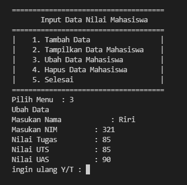

# Praktikum08
## Program sederhana dengan mengaplikasikan penggunaan class
### Penjelasan Program
Ini Adalah Program Penginputan data mahasiswa menggunakan fungsi class dataMahasiswa
#####
Disini saya menggunakan Fungsi dari dictionary juga untuk menyimpan data dari inputan
#####
Cara kerja program
#####
Ketika di run Program menyediakan menu menu yang bisa anda pilih seperti

"1" untuk fungsi Tambah
guna fungsi tambah, kita di minta untuk menginput Nama, Nim, Nilai Tugas, Nilai UTS, Nilai UAS lalu program akan menyimpan datanya di dictionary untuk melihat hasil

"2" untuk fungsi lihat
guna fungsi lihat untuk melihat list dengan data yang tersimpan

"3" untuk fungsi Ubah
guna fungsi ini untuk mengubah data jika ada kesalahan saat input

"4" untuk fungsi Hapus
guna fungsi ini untuk menghapus data yang sudah kita input

"5" untuk fungsi Keluar
guna fungsi ini untuk keluar dari program

Disini juga ada pertanyaan Y/T Jika memilih Y user akan di bawa kembali ke menu dan T akan mengakhiri Program
#### Berikut Cara Kerja Berdasarkan Flowchartnya

#### Berikut Bentuk dari Code Python Nya

#### Berikut Adalah tampilan pertama kali run Program

#### Berikut Contoh Penggunaan Kode 1. Tambah

#### Disini juga ada pertanyaan Y/T Jika memilih Y user akan di bawa kembali ke menu dan T akan mengakhiri Program
#### Berikut Contoh Penggunaan Kode 2. Lihat/Tampilkan

#### Berikut Contoh Penggunaan Kode 3. Ubah

#### Berikut Contoh Penggunaan Kode 4. Hapus

#### Berikut Contoh Penggunaan Kode 5. eluar

### Disini Saya belum bisa membuat Diagram class karna masih belum paham, mohon maaf pak dosen